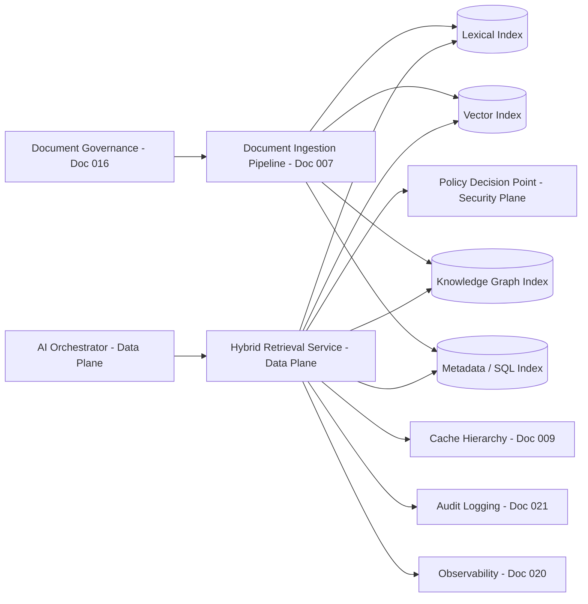
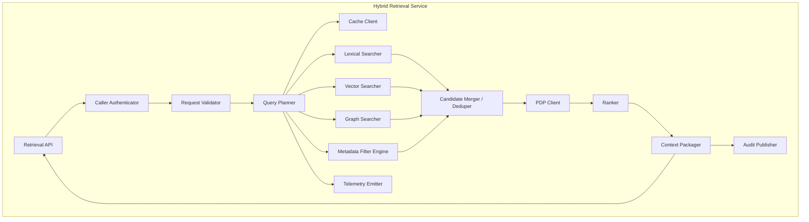
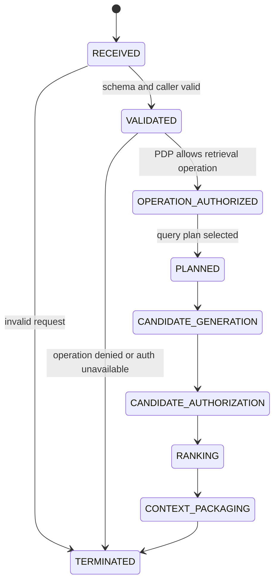
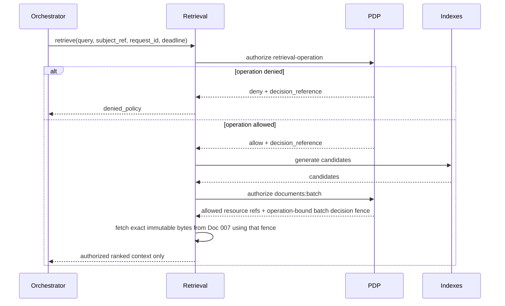
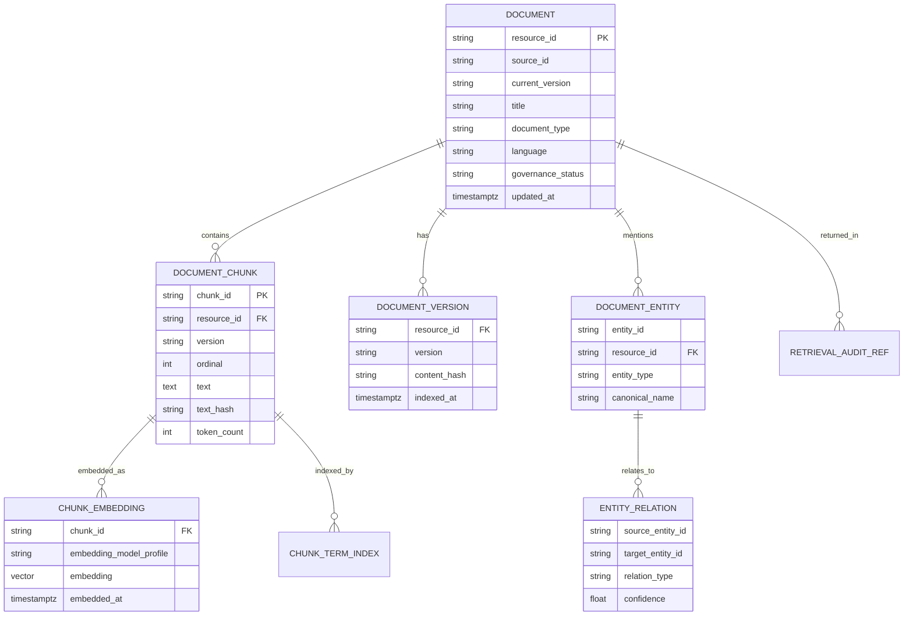
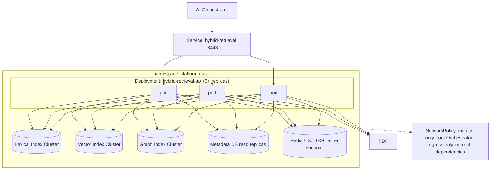

# 006 - Hybrid Retrieval Service

| | |
|---|---|
| **Document status** | Production-reconciled architecture v4; implementation evidence pending |
| **Plane** | Data Plane |
| **Conforms to** | Doc 001 live authorization/revision, endpoint posture, derived disclosure, audit admission, retention-not-access and telemetry contracts; Docs 002-005 v4 |
| **Depends on** | 004 Orchestrator, 005 PDP, 007 Ingestion and index publication, 009 optional caches, 010 embedding profiles, 016 Governance, 021 Audit, 023 Sovereign Boundary, 024 Contracts, 025 Workload Identity |

---

## 1. Executive Summary

The Hybrid Retrieval Service is the platform's query-time document and knowledge retrieval subsystem. It accepts a retrieval request from the AI Orchestrator, searches multiple sovereign indexes, authorizes candidate resources through the Policy Decision Point, ranks only authorized candidates, and returns bounded, citation-ready context to the Orchestrator.

The service is "hybrid" because it combines lexical search, vector search, graph expansion, and structured metadata filters. It is not a document ingestion pipeline, not a document governance system, not a cache hierarchy, not an authorization engine, and not a prompt composer. Its core responsibility is runtime retrieval execution: find relevant candidates, prove they are authorized, rank them, and return a compact result set with enough metadata for audit, citations, and downstream context composition.

**System-design framework coverage: 10/10.** Functional and non-functional requirements, capacity formulas, redundancy, index/data scaling, caching boundaries, synchronous audit admission, asynchronous index-update interactions, monitoring, deployment strategy, and tradeoffs are all covered. No diagnostic rows are intentionally failing.

## 1.1 Architecture Research / Industry Evidence

| Decision | External evidence | Why it works there | Applicability to us | Decision |
|---|---|---|---|---|
| Fuse independent lexical and vector rankings | Elastic's hybrid-search guidance recommends Reciprocal Rank Fusion (RRF) to combine separate result lists: https://www.elastic.co/docs/solutions/search/hybrid-search and https://www.elastic.co/docs/reference/elasticsearch/rest-apis/reciprocal-rank-fusion | Rank-based fusion avoids assuming incomparable BM25/vector score scales | Fits model-agnostic lanes and allows each index to scale independently | **Adopt** deterministic bounded RRF as the baseline; learned reranking remains an evaluated optional stage |
| Treat ANN as a measured recall/latency tradeoff | The HNSW paper defines a scalable approximate graph search, while later worst-case research shows popular ANN implementations have adversarial limitations: https://arxiv.org/abs/1603.09320 and https://proceedings.neurips.cc/paper_files/paper/2023/hash/d0ac28b79816b51124fcc804b2496a36-Abstract-Conference.html | ANN reduces search cost but can silently lose recall under data/query distributions | Enterprise corpora and filters differ materially | **Adapt** HNSW/other ANN only after corpus-specific recall, memory, build, delete and p99 tests; retain exact evaluation samples |
| Do not make search-index security the authority | Elasticsearch documents document/field-security and aggregation limitations: https://www.elastic.co/guide/en/elasticsearch/reference/current/security-limitations.html | Index-side filtering is useful but does not eliminate inference, stale-metadata or aggregation risks | Our ACL/classification can change independently of an index generation | **Reject** index tags as authorization; use them only to prune before fresh PDP and authoritative content fetch |
| Carry explicit authorization consistency revisions | Google Zanzibar uses consistency tokens/revisions to avoid stale authorization relationships: https://research.google/pubs/zanzibar-googles-consistent-global-authorization-system/ | A caller can bind a decision to a known relationship snapshot instead of trusting TTL | Same correctness problem at smaller sovereign scale | **Adapt** exact subject/resource/policy revisions and one-operation fences; no Zanzibar runtime dependency |

## 2. Purpose and Scope

**Purpose:** make retrieval usable by the sovereign AI platform without violating live authorization, zero-egress, or subsystem ownership boundaries.

**In scope:**
- Query-time retrieval across lexical, vector, graph, and structured metadata indexes
- Candidate generation, candidate merging, deduplication, reranking, and context packaging
- Retrieval-operation authorization through PDP before expensive candidate expansion when required
- Candidate document/chunk authorization through PDP before returning context
- Returning non-enumerating `no_context`, typed operation denial, and typed dependency failure
- Deadline and cancellation handling from the Orchestrator
- Retrieval-specific audit and observability
- Index-read path and serving topology
- Retrieval API contracts for Orchestrator and future Internal Developer Platform endpoints

**Out of scope:**
- Document ingestion, OCR, extraction, chunking, embedding generation, and index writes: Document Ingestion Pipeline, Doc 007
- Source document ACL, classification, publication, lifecycle, legal hold, retention, provenance, integrity state and resource-security revision: Document Governance Service, Doc 016
- Subject identity, group, organization and clearance facts: Identity Sync Service, Doc 002; endpoint posture: Doc 023
- Authorization policy evaluation: PDP, Doc 005
- Response, semantic, retrieval, and embedding cache ownership: Cache Hierarchy, Doc 009
- Model inference, query rewriting by LLM, and reranking by model: Model Gateway/Inference documents, Docs 011-012, unless a later explicit contract permits internal model-backed reranking
- Prompt composition and final context ordering in the LLM request: AI Orchestrator, Doc 004

## 3. Architectural Position / Plane

Retrieval is a **Data Plane** service. It performs request-path data access, but it does not own the upstream content lifecycle or the policy decision. It sits between the Orchestrator and retrieval indexes, with PDP authorization on the critical path before any retrieved content leaves the service.



The Orchestrator never queries retrieval stores directly. The Retrieval Service never returns unauthorized content to the Orchestrator.

## 4. Responsibilities and Non-Responsibilities

**Responsibilities:**
- Accept `subject_ref`, server `request_id` and typed authentication context from the Orchestrator
- Validate request shape, retrieval mode, corpus, filters, and deadline
- Authorize retrieval operation scope through PDP when the query targets protected corpora or request classes
- Generate candidates from lexical, vector, graph, and structured indexes
- Merge, deduplicate, score, and rerank candidates
- Batch-authorize candidate resources through PDP before content leaves Retrieval
- Return only authorized context chunks, exact source lineage/classification revisions and citation metadata
- Preserve operation denial and dependency failure while collapsing all zero-authorized-context cases to `no_context`
- Emit retrieval audit events with PDP decision references
- Export metrics and traces for each retrieval stage
- Respect Orchestrator deadlines and cancellations

**Non-responsibilities (binding):**
- **Not the PDP.** Retrieval calls PDP; it never embeds policy logic or caches final authorization decisions as source of truth.
- **Not ISS or Endpoint Security.** Retrieval does not synchronize subject identity/group/organization/clearance facts or endpoint posture truth.
- **Not ingestion.** Retrieval reads serving indexes; Doc 007 owns OCR, parsing, chunking, embeddings, and index updates.
- **Not document governance.** Retrieval consumes revisioned candidate hints and requests live PDP authorization; Doc 016 owns ACL, classification, publication, retention, legal hold, provenance, integrity and lifecycle truth.
- **Not the cache owner.** Retrieval may use Doc 009 cache APIs, but it does not define platform-wide cache semantics or response-cache keys.
- **Not an LLM caller by default.** Retrieval does not call the Model Gateway to rewrite queries or rerank results unless a later reviewed contract adds that capability.
- **Not a prompt composer.** Retrieval returns structured context; the Orchestrator composes the prompt.
- **No external search or embedding service.** All indexes and embeddings are sovereign and internal.
- **No hidden request queue.** If per-instance concurrency is exhausted, Retrieval fails fast with a typed overload response.

## 5. Dependencies

| Dependency | Type | Purpose | Failure impact if unavailable |
|---|---|---|---|
| AI Orchestrator (Doc 004) | Upstream internal | Calls Retrieval during context resolution | No retrieval requests reach the service |
| PDP (Doc 005) | Internal security | Authorizes retrieval operations and candidate resources | Authorization-dependent retrieval fails closed; return typed `authorization_unavailable` |
| Lexical Index | Retrieval-owned serving store populated by Doc 007 | BM25/keyword candidate generation | Hybrid retrieval degrades only if request class allows lexical-optional behavior |
| Vector Index | Retrieval-owned serving store populated by Doc 007 | Semantic candidate generation | Semantic retrieval degrades only if request class allows vector-optional behavior |
| Graph Index | Retrieval-owned serving store populated by Doc 007/016 | Relationship expansion and entity-neighborhood search | Graph expansion skipped if optional; graph-required requests fail |
| Metadata / SQL Index | Retrieval-owned serving store populated by Doc 007/016 | Filters, document/chunk metadata, source versions | Required for most requests; unavailable usually fails retrieval |
| Cache Hierarchy (Doc 009) | Internal data plane | Retrieval-result and metadata cache APIs | Cache miss/fallback to indexes; never fail solely because cache is unavailable |
| Audit Logging Service (Doc 021) | Internal | Immutable retrieval/disclosure evidence | Protected context is not returned until compact disclosure intent reaches quorum |
| Observability Stack (Doc 020) | Internal | Metrics, traces, logs | Service continues with reduced visibility |
| Secrets Management (Doc 025) | Internal | mTLS certs and datastore credentials | New cert issuance fails; existing certs valid until expiry |

## 6. Upstream and Downstream Services

| Direction | Service | Contract |
|---|---|---|
| Upstream | AI Orchestrator | Calls `/v1/retrieve` with subject reference, request ID, deadline, mode, query and filters |
| Downstream | PDP | Retrieval calls `/v1/authorize/retrieval-operation` and `/v1/authorize/documents:batch` |
| Downstream | Cache Hierarchy | Retrieval may cache immutable index/embedding/metadata objects and exact dependency manifests; every protected hit still receives a fresh PDP decision |
| Downstream | Sovereign Document Content Store (Doc 007) | Fetches immutable authorized chunk/version bytes after PDP allow |
| Downstream | Audit Logging | Retrieval emits query, candidate, authorization, and returned-context audit references |
| Input writer | Document Ingestion Pipeline | Writes/indexes chunks and embeddings into serving indexes using Doc 006 schemas and Doc 007 pipeline rules |
| Governance authority | Document Governance Service | Supplies current ACL/classification/publication/processing/integrity facts to PDP; preservation/hold never grants normal retrieval |

## 7. Component Architecture



| Component | Responsibility |
|---|---|
| **Retrieval API** | Internal API surface for Orchestrator and future stable platform APIs |
| **Caller Authenticator** | Verifies Orchestrator service identity over mTLS |
| **Request Validator** | Enforces schema, payload limits, corpus allow-list, deadline presence, and filter validity |
| **Query Planner** | Chooses search lanes: lexical, vector, graph, structured, or hybrid |
| **Cache Client** | Uses Doc 009 for immutable revision-addressed objects/candidate refs; every protected hit is freshly authorized |
| **Lexical Searcher** | BM25/keyword search over chunk text and metadata |
| **Vector Searcher** | ANN/kNN search over internal embeddings |
| **Graph Searcher** | Entity and relationship expansion over the knowledge graph index |
| **Metadata Filter Engine** | Applies structured filters such as source, type, department, retention status, version, language |
| **Candidate Merger / Deduper** | Normalizes candidates from all lanes into a single bounded candidate set |
| **PDP Client** | Calls PDP for operation and candidate authorization and records decision references |
| **Ranker** | Scores authorized candidates using deterministic retrieval features |
| **Context Packager** | Returns chunk text, citation metadata, scores, provenance references, and truncation markers |
| **Audit Publisher** | Obtains quorum admission for one compact pre-disclosure attempt record before protected bytes leave Retrieval |
| **Telemetry Emitter** | Metrics and traces for every stage |

## 8. Retrieval Modes

| Mode | Purpose | Search lanes |
|---|---|---|
| `lexical` | Exact term, identifier, policy/code/reference lookup | Lexical + metadata |
| `semantic` | Conceptual similarity | Vector + metadata |
| `graph` | Entity/relationship neighborhood lookup | Graph + metadata |
| `hybrid` | Default RAG retrieval | Lexical + vector + metadata, optional graph expansion |
| `structured` | Metadata-only retrieval | SQL/metadata filters |
| `citation_refresh` | Re-fetch exact cited chunks by ID/version | Metadata + PDP, no broad search |

`hybrid` is the default for RAG. `citation_refresh` exists so downstream components can revalidate cited context by immutable chunk/version reference without repeating broad candidate generation.

## 9. Request Lifecycle



Terminal outcomes:

| Outcome | Meaning |
|---|---|
| `completed` | Authorized context returned |
| `no_context` | No authorized context can be returned; client cannot distinguish no candidate from denied candidate |
| `denied_policy` | PDP denied the retrieval operation itself |
| `failed_downstream` | Required index/PDP/datastore dependency failed |
| `cancelled_deadline` | Deadline expired |
| `cancelled_client` | Orchestrator propagated client cancellation |
| `overloaded` | Retrieval concurrency limit reached; no hidden queue created |

Candidate/no-candidate/denied-candidate distinctions are audit-only. The Orchestrator receives the same `no_context` response for every zero-authorized-result case, removing status/count distinctions; timing is mitigated as described below. An operation-level policy denial remains a typed denial because the caller already knows the operation it attempted.

Zero-context paths use the same response schema, cache headers and coarse latency bucket. Retrieval enforces a bounded minimum response window with small jitter after operation authorization, and repeated probes are rate limited; it does not expose exact lane or PDP timing. This reduces practical existence oracles without an unbounded padding queue. Adversarial tests compare timing distributions for no-match, all-denied and stale/withdrawn resources.

## 10. Authorization Model

Retrieval performs two PDP calls for protected retrieval:

1. **Retrieval operation authorization**: "May this identity perform this retrieval class against this corpus/source/filter scope?"
2. **Candidate document/chunk authorization**: "May this identity read these candidate resources?"



Retrieval never returns unauthorized text, embeddings, titles, IDs, scores, counts, timing distinctions or "near miss" summaries. Candidate filters/tags are optimizations only; PDP evaluates current subject and resource security revisions for every request.

For an authorized non-empty context result, Retrieval also returns an internal-only `context_authorization_manifest`: immutable resource/version/chunk references, content hashes, source classification references, packaged-context digest, candidate decision IDs, source subject/resource/policy revision digests, retrieval purpose and timestamp. This is not a reusable authorization credential and contains no document text. Doc 004 must obtain a fresh PDP `AuthorizeContextUse` decision over this exact manifest immediately before generation start; Doc 014 repeats that decision at a tool boundary. The manifest becomes immutable lineage input to Doc 016's final derived-output classification and exposure calculation. A no-context result carries no manifest.

## 11. Candidate Generation

Candidate generation is intentionally multi-lane:

| Lane | Input | Output | Notes |
|---|---|---|---|
| Lexical | Query tokens, filters | Chunk IDs with BM25-like score | Handles exact names, IDs, quotes, policy terms |
| Vector | Query embedding, filters | Chunk IDs with ANN similarity score | Handles semantic paraphrase |
| Graph | Entities, relations, filters | Document/chunk/entity IDs | Handles entity neighborhoods and dependency trails |
| Metadata | Structured filters | Candidate constraints | Ensures corpus/source/version/status filtering |

The Query Planner decides lane participation using request mode, query features, corpus metadata, and deadline budget. It does not call an LLM to do this in Phase 1.

## 12. Candidate Merge and Ranking

The Candidate Merger normalizes all lanes into:

```json
{
  "resource_id": "doc_4471",
  "chunk_id": "chunk_4471_0007",
  "content_version": "v12",
  "source_id": "sharepoint-legal",
  "lane_scores": {
    "lexical": 14.2,
    "vector": 0.81,
    "graph": 0.33
  },
  "metadata": {
    "language": "en",
    "document_type": "policy",
    "updated_at": "2026-08-08T10:30:00Z"
  }
}
```

Ranking happens after PDP candidate authorization. Denied candidates may be counted for audit and metrics, but they are not ranked for return and their content is never loaded into the context package.

Ranking features may include:
- normalized lexical score
- normalized vector score
- graph proximity score
- freshness/version score
- source reliability/governance status
- exact-title or exact-identifier match
- chunk adjacency/coherence
- query-mode-specific boosts

## 13. Data Model



This is a serving model. Doc 007 owns how records are produced, validated, and updated.

## 14. PostgreSQL / Index Schema (Reference)

```sql
CREATE TABLE retrieval_document (
    resource_id         TEXT PRIMARY KEY,
    source_id           TEXT NOT NULL,
    current_version     TEXT NOT NULL,
    title               TEXT NOT NULL,
    document_type       TEXT NOT NULL,
    language            TEXT NOT NULL DEFAULT 'unknown',
    governance_status   TEXT NOT NULL,
    source_updated_at   TIMESTAMPTZ NOT NULL,
    indexed_at          TIMESTAMPTZ NOT NULL DEFAULT now()
);

CREATE TABLE retrieval_document_version (
    resource_id     TEXT NOT NULL REFERENCES retrieval_document(resource_id),
    version         TEXT NOT NULL,
    content_hash    TEXT NOT NULL,
    indexed_at      TIMESTAMPTZ NOT NULL DEFAULT now(),
    PRIMARY KEY (resource_id, version)
);

CREATE TABLE retrieval_chunk (
    chunk_id        TEXT PRIMARY KEY,
    resource_id     TEXT NOT NULL,
    version         TEXT NOT NULL,
    ordinal         INT NOT NULL,
    text_hash       TEXT NOT NULL,
    text            TEXT NOT NULL,
    token_count     INT NOT NULL,
    metadata        JSONB NOT NULL DEFAULT '{}',
    FOREIGN KEY (resource_id, version)
        REFERENCES retrieval_document_version(resource_id, version)
);

CREATE INDEX idx_retrieval_chunk_resource
    ON retrieval_chunk(resource_id, version, ordinal);

CREATE INDEX idx_retrieval_document_source
    ON retrieval_document(source_id, governance_status);
```

Vector and graph stores may use specialized engines, but they must expose the same stable identifiers: `resource_id`, `version`, and `chunk_id`.

## 15. API Contract: Retrieve

**Request:**

```json
{
  "request_id": "0198...-uuidv7",
  "correlation_id": "corr_9f2a...",
  "subject_ref": "subject_9f3b1e2a...",
  "query": {
    "text": "summarize the current travel reimbursement policy",
    "mode": "hybrid",
    "top_k": 12
  },
  "filters": {
    "corpus": ["policy"],
    "source_ids": ["sharepoint-hr"],
    "language": "en"
  },
  "retrieval_class": "rag_context",
  "deadline": "2026-08-09T14:03:12.500Z"
}
```

**Response:**

```json
{
  "status": "completed",
  "request_id": "0198...-uuidv7",
  "correlation_id": "corr_9f2a...",
  "retrieval_id": "ret_01J4Z7...",
  "operation_decision_reference": "pdp_dec_01J4Z6...",
  "results": [
    {
      "resource_id": "doc_4471",
      "chunk_id": "chunk_4471_0007",
      "version": "v12",
      "title": "Travel Reimbursement Policy",
      "text": "Employees may request reimbursement...",
      "score": 0.92,
      "citation": {
        "source_id": "sharepoint-hr",
        "uri_ref": "source://sharepoint-hr/doc_4471",
        "content_hash": "sha256:..."
      },
      "decision_reference": "pdp_dec_01J4Z8..."
    }
  ]
}
```

No response field may expose the titles, snippets, metadata, or counts of denied documents in a way that leaks sensitive existence information, except aggregate audit fields sent to Doc 021.

## 16. Status and Error Semantics

| Status / error | Meaning | Orchestrator mapping |
|---|---|---|
| `completed` | Authorized results returned | Continue context composition |
| `no_context` | No authorized context is returned; underlying cause is intentionally indistinguishable | Continue or report no context without existence details |
| `denied_policy` | Retrieval operation itself denied | Orchestrator terminates `denied_policy` for required retrieval |
| `authorization_unavailable` | PDP unavailable or failed to evaluate | `failed_downstream` unless caller maps to fail-closed policy denial UX |
| `index_unavailable` | Required index unavailable | `failed_downstream` |
| `deadline_exceeded` | Deadline expired | `cancelled_deadline` |
| `cancelled` | Orchestrator cancellation propagated | `cancelled_client` or `cancelled_explicit` |
| `overloaded` | Per-instance concurrency full | `failed_downstream` with retry/backoff guidance |

## 17. OpenAPI Excerpt

```yaml
openapi: 3.0.3
info:
  title: Hybrid Retrieval Service API
  version: 1.0.0
servers:
  - url: https://hybrid-retrieval.internal.platform.local/v1
paths:
  /retrieve:
    post:
      summary: Retrieve authorized context for an AI request
      requestBody:
        required: true
        content:
          application/json:
            schema:
              type: object
              required: [request_id, subject_ref, query, retrieval_class, deadline]
              properties:
                request_id: { type: string, format: uuid }
                correlation_id: { type: string }
                subject_ref: { type: string }
                query:
                  type: object
                  required: [text, mode]
                  properties:
                    text: { type: string, maxLength: 8192 }
                    mode: { type: string, enum: [lexical, semantic, graph, hybrid, structured, citation_refresh] }
                    top_k: { type: integer, minimum: 1, maximum: 50 }
                filters: { type: object }
                retrieval_class: { type: string }
                deadline: { type: string, format: date-time }
      responses:
        '200': { description: Retrieval completed or returned typed no-result status }
        '400': { description: Malformed request }
        '401': { description: Caller service identity invalid }
        '403': { description: Retrieval operation denied by policy }
        '429': { description: Retrieval service overloaded }
        '503': { description: Required dependency unavailable }
```

## 18. Cache Strategy

Retrieval uses caches but does not own platform cache architecture.

| Cache use | Owner | Key safety requirement |
|---|---|---|
| Query-plan cache | Retrieval | Contains no protected content |
| Metadata lookup cache | Retrieval / Doc 009 integration | Immutable object keyed by exact content/resource-security revision; current head verified before protected use |
| Candidate-ID cache | Cache Hierarchy, Doc 009 | May cache query-to-immutable candidate refs only; every hit receives fresh batch PDP authorization before content fetch |
| Embedding cache | Cache Hierarchy / Doc 007 | Internal embedding model/profile keyed; no external embedding API |
| Authorization decisions | Not cached | A new PDP batch decision is required for each request/operation |

Retrieval may cache candidate IDs as internal search acceleration, but never exposes cache hit/miss, candidate existence or counts. Shared protected generated-response/semantic caches are disabled; authorized content is fetched by immutable version after the fresh decision.

## 19. Index Update and Freshness Model

Doc 007 owns index writes, but Retrieval defines serving expectations:

- Index records are versioned by `resource_id`, `version`, and `chunk_id`.
- Retrieval reads only committed index snapshots.
- A document update produces a new version; existing citations can be revalidated by exact version through `citation_refresh`.
- Ingestion-time ACL tags are search-space optimizations only. PDP remains authoritative at query time.
- Governance ACL/classification/publication/processing/integrity state is authoritative only through the fresh PDP read. Preservation/legal-hold state is not a normal retrieval predicate and never grants access.
- Index freshness SLOs are measured as `source_updated_at` to `indexed_at`; final targets belong jointly to Docs 006 and 007 after benchmarking.

## 20. Deadline and Cancellation

Retrieval receives one absolute deadline from the Orchestrator. It derives bounded stage budgets:

```text
remaining_budget =
  deadline - now - serialization_reserve

operation_authorization_budget
candidate_generation_budget
candidate_authorization_budget
ranking_packaging_budget
```

Rules:
- If the deadline is missing or already expired, reject the request.
- Candidate generation lanes must observe cancellation.
- Retrieval cancels outstanding index calls when enough candidates have been found or deadline is near exhaustion.
- PDP calls receive sub-deadlines.
- No request stage may keep running to "finish in the background" after cancellation. The required disclosure-attempt audit event was already quorum committed before any protected bytes could leave.

## 21. Retry Policy

Each row applies only when the propagated operation context names Retrieval as retry owner and its non-resettable token remains. Consuming the token is returned in typed attempt state so Orchestrator cannot replay the Retrieval workflow. If PDP consumes the decision operation's token for an internal revision race, Retrieval cannot add a second PDP attempt.

| Operation | Retry policy |
|---|---|
| PDP retrieval-operation authorization | At most one bounded retry before any candidate search if no response received and deadline permits |
| PDP candidate batch authorization | At most one bounded retry if no response received; never convert failure into allow |
| Lexical/vector/graph index reads | At most one retry for idempotent read failures if request class requires that lane |
| Cache reads | No retry on request path; treat as miss |
| Cache writes | Best effort, asynchronous where possible |
| Audit admission | Retry only within request deadline; protected disclosure fails if quorum append cannot complete |

Policy denials are never retried. Caller validation failures are never retried.

## 22. Concurrency and Backpressure

Retrieval is horizontally scalable and stateless with respect to request workflow. Per-instance concurrency is bounded by:

- active retrieval requests
- active index lane calls
- active PDP batch calls
- memory used by candidate sets
- p99 stage latency

When limits are reached, the service returns `429 overloaded`. It does not enqueue requests internally. Queues are appropriate in Doc 007 ingestion and Doc 013 workload scheduling, not in this synchronous retrieval request path.

## 23. Capacity Planning Methodology

Core formulas:

```text
retrieval_qps =
  rag_request_qps * retrievals_per_rag_request

candidate_authorization_units_per_second =
  retrieval_qps * avg_candidates_sent_to_pdp

index_read_qps_by_lane =
  retrieval_qps * lane_participation_rate

retrieval_context_bytes_per_second =
  retrieval_qps * avg_returned_chunks * avg_chunk_bytes

index_storage =
  document_count * avg_versions_retained * avg_chunks_per_document * per_chunk_index_bytes
```

Benchmark gates:
- average and p99 candidate generation latency per lane
- PDP candidate batch latency by batch size
- Governance/PDP end-to-end authorization admission at 100, 500, and 1,000 candidates/request while resource-security revisions change concurrently
- vector index recall/latency curve
- lexical index p99 under realistic corpus size
- graph expansion fanout limits
- memory footprint per active retrieval
- immutable-object/candidate-cache hit ratio plus fresh-PDP latency on hits

No pod counts, shard counts, or index-size commitments are asserted without those benchmarks.

## 24. Scaling Strategy

- Retrieval API pods scale horizontally.
- Indexes scale by corpus/source partitioning first, then by shard key if corpus growth requires it.
- Vector index partitions should preserve recall measurement; sharding must be validated against retrieval-quality benchmarks.
- Lexical index replicas serve read traffic; writes are handled by Doc 007 ingestion flows.
- Metadata store uses read replicas as query volume grows.
- Graph expansion is fanout-limited to prevent one entity from dominating request cost.
- Autoscaling uses active retrieval count, p95/p99 retrieval latency, index lane saturation, and PDP latency, not CPU alone.

## 25. Deployment / Kubernetes



Readiness requires:
- required indexes reachable
- PDP reachable
- service identity cert valid
- active configuration loaded

Readiness should not require Audit Logging or Observability to be reachable.

## 26. Security Model

- All service-to-service traffic uses mTLS with certs from Doc 025.
- Retrieval accepts request traffic only from the Orchestrator service identity, plus explicitly approved Doc 024 internal APIs when that document defines stable direct retrieval endpoints.
- Retrieval sends `subject_ref`, `request_id` and resource refs to PDP; it does not forward or trust authorization attributes.
- Retrieval does not expose direct datastore access to clients or other services.
- Doc 023's physical route/firewall/DNS boundary denies public egress; NetworkPolicy is additional pod-level isolation.
- Retrieved chunk text is treated as sensitive data and is never written to logs or traces.
- Audit events use hashes/stable references for protected resources where possible.

## 27. Audit Logging

Minimum retrieval audit event:

```json
{
  "event_type": "retrieval.disclosure.attempt",
  "request_id": "0198...-uuidv7",
  "retrieval_id": "ret_01J4Z7...",
  "correlation_id": "corr_9f2a...",
  "caller_service": "ai-orchestrator",
  "subject_ref_hmac": "hmac-sha256:...",
  "retrieval_class": "rag_context",
  "mode": "hybrid",
  "operation_decision_reference": "pdp_dec_01J4Z6...",
  "subject_security_revision": 483107,
  "resource_security_revision_digest": "sha256:...",
  "candidate_count": 87,
  "authorized_candidate_count": 14,
  "returned_count": 12,
  "returned_resource_refs": [
    {
      "resource_ref_hmac": "hmac-sha256:...",
      "chunk_ref_hmac": "hmac-sha256:...",
      "decision_reference": "pdp_dec_01J4Z8..."
    }
  ],
  "status": "admitted_attempt",
  "producer_timestamp": "2026-08-09T14:03:11.204Z"
}
```

Before any protected chunk leaves Retrieval, a compact `retrieval.disclosure.attempt` containing request, decision and exact resource/version references must quorum-commit under `AUDIT-ADMISSION`. For a read, this committed pre-disclosure attempt is the authoritative security event: transport success cannot prove that a remote client actually consumed bytes, and Retrieval has no business-state aggregate whose outbox could prove that fact. Network completion/cancellation is content-free telemetry. State-changing services still use Doc 021's intent plus authoritative-owner-outbox outcome pair. Audit captures what Retrieval was authorized to attempt without storing retrieved text.

## 28. Observability

Prometheus metrics:

```text
retrieval_requests_total{mode,status}
retrieval_request_duration_seconds{mode}
retrieval_stage_duration_seconds{stage}
retrieval_candidate_count{mode}
retrieval_authorized_candidate_count{mode}
retrieval_returned_chunk_count{mode}
retrieval_index_lane_requests_total{lane,status}
retrieval_index_lane_duration_seconds{lane}
retrieval_pdp_batch_duration_seconds
retrieval_cache_hit_ratio{cache_type}
retrieval_overload_rejections_total
retrieval_cancellations_total{reason}
retrieval_audit_admission_failures_total
```

OpenTelemetry spans:

```text
retrieval.request.handle
retrieval.operation_authorize
retrieval.plan
retrieval.lexical.search
retrieval.vector.search
retrieval.graph.search
retrieval.metadata.filter
retrieval.candidates.merge
retrieval.candidates.authorize
retrieval.rank
retrieval.context.package
retrieval.audit.admit
```

Trace attributes use mandatory `request_id`, optional sanitized `correlation_id`, retrieval ID, mode and status. Raw resource/user/query identifiers and text are excluded; governed HMAC references may be used.

## 29. SLOs

Initial SLO posture:

| SLI | Target posture |
|---|---|
| Retrieval API availability | Same class as Orchestrator for RAG-critical paths |
| Retrieval p99 latency | Must fit within Orchestrator retrieval sub-deadline after benchmarking |
| Authorization correctness | 100%: no unauthorized content returned |
| Non-enumeration correctness | 100%: no-candidate and all-denied produce indistinguishable `no_context`; denied identities/counts remain audit-only |
| Index freshness | Benchmark-defined jointly with Doc 007 |
| Citation revalidation correctness | Exact chunk/version lookup returns same content hash or explicit stale/version-missing status |

No numeric p99 is asserted without real index and corpus benchmarks.

## 30. Configuration

This is an illustrative configuration shape and an initial adversarial-test envelope, not an accepted production SLO. Corpus/hardware benchmarks and the end-to-end deadline budget must approve every numerical value before deployment.

```yaml
service:
  name: hybrid-retrieval-service
  port: 8443

retrieval:
  default_mode: hybrid
  max_query_chars: 8192
  max_top_k: 50
  max_candidate_set_size: 1000
  max_graph_expansion_depth: 2
  serialization_reserve_ms: 25

authorization:
  pdp_endpoint: "https://pdp.internal.platform.local/v1"
  authorize_operation: true
  admission_batch_max: 1000

indexes:
  lexical_endpoint: "https://lexical-index.platform-data.svc.cluster.local"
  vector_endpoint: "https://vector-index.platform-data.svc.cluster.local"
  graph_endpoint: "https://graph-index.platform-data.svc.cluster.local"
  metadata_endpoint: "postgresql://retrieval-metadata.platform-data.svc.cluster.local"

cache:
  cache_hierarchy_endpoint: "https://cache-hierarchy.platform-data.svc.cluster.local"
  candidate_reference_cache_enabled: true
  protected_generated_response_cache_enabled: false

audit:
  admission_endpoint: "https://audit-logging.internal.platform.local/v1/intents"
  max_in_flight: 256
  admission_timeout_ms: 250
  unavailable_policy: fail_closed

egress:
  allow_list:
    - pdp.internal.platform.local
    - audit-logging.internal.platform.local
    - observability.internal.platform.local
    - secrets-management.internal.platform.local
    - lexical-index.platform-data.svc.cluster.local
    - vector-index.platform-data.svc.cluster.local
    - graph-index.platform-data.svc.cluster.local
    - retrieval-metadata.platform-data.svc.cluster.local
```

## 31. Helm Values Example

```yaml
retrieval:
  replicaCount: 3
  resources:
    requests: { cpu: "1", memory: "2Gi" }
    limits:   { cpu: "4", memory: "8Gi" }
  autoscaling:
    enabled: true
    minReplicas: 3
    maxReplicas: 30
    metrics:
      - type: Pods
        pods:
          metric: { name: retrieval_active_requests }
          target: { type: AverageValue, averageValue: "100" }

podDisruptionBudget:
  minAvailable: 2

networkPolicy:
  enabled: true
  ingressAllowList:
    - ai-orchestrator
  egressAllowList:
    - policy-decision-point
    - cache-hierarchy
    - audit-logging-service
    - observability-stack
    - secrets-management
    - lexical-index
    - vector-index
    - graph-index
    - retrieval-metadata
```

## 32. Failure Mode Matrix

| Failure | Behavior |
|---|---|
| Orchestrator unavailable | No request reaches Retrieval |
| Missing/invalid typed authentication context or subject ref | Reject before retrieval; no index query |
| PDP operation authorization denies | Return `denied_policy`; no candidate search |
| PDP unavailable | Return `authorization_unavailable`; fail closed |
| Lexical index unavailable | Degrade only if request mode does not require lexical; otherwise fail |
| Vector index unavailable | Degrade only if request mode does not require semantic/vector; otherwise fail |
| Graph index unavailable | Skip optional graph expansion or fail graph-required request |
| Metadata store unavailable | Fail most requests because filters/version/content metadata cannot be trusted |
| Cache unavailable | Treat as miss; request continues |
| Audit quorum unavailable | Return no protected context; fail/park only within deadline; no local-only acknowledgement |
| Observability unavailable | Request path continues |
| Deadline exceeded | Cancel index/PDP calls and return `deadline_exceeded` |
| Service overloaded | Return `429 overloaded`; no hidden queue |

## 33. Threat Model

| Threat (STRIDE) | Vector | Mitigation |
|---|---|---|
| Spoofing | Non-Orchestrator service calls Retrieval | mTLS service identity and ingress allow-list |
| Tampering | Index record altered to point at wrong content | Content hash, versioned records, Doc 016 provenance/integrity |
| Repudiation | Dispute over why context was returned | Retrieval audit plus PDP decision references |
| Information Disclosure | Denied documents leak via snippets/counts/metadata | Authorize before packaging, bounded aggregate response, no denied metadata exposure |
| Denial of Service | Expensive broad query or graph fanout | Query limits, candidate caps, graph depth limits, overload fail-fast |
| Elevation of Privilege | Cached candidate/content dependency served after revocation | Exact immutable dependencies plus a fresh PDP batch decision before every protected content fetch/return |

## 34. Testing Strategy

| Layer | Approach |
|---|---|
| Unit | Query planner, candidate merge, dedupe, ranking normalization, status mapping |
| Authorization fixtures | PDP allow/deny/all-denied/no-match matrix, verifying no unauthorized text returns |
| Integration | Orchestrator -> Retrieval -> PDP -> indexes with mocked index lanes |
| Contract | OpenAPI conformance and Doc 004 response semantics |
| Index correctness | Golden query sets for lexical/vector/graph/metadata recall |
| Chaos | PDP outage, one index unavailable, metadata DB failover, cache outage, deadline cancellation |
| Load | Representative corpus, candidate sizes, and mixed modes at 2x expected Phase 1 request volume |
| Security | Status/count/timing existence-leak tests, forged security-fact rejection, direct datastore denial, trace/log content scans |

## 35. Operational Runbook

**Incident: client-visible `no_context` spike**
1. Check index lane health and recent Doc 007 ingestion failures.
2. Split by corpus/source to identify source-specific indexing issues.
3. Verify query planner did not disable a lane through bad config.

**Incident: audit-only denied-candidate ratio spike**
1. Check PDP policy version and decision metrics.
2. Check ISS subject/group revisions and Governance resource ACL/classification revisions for affected sources.
3. Treat as security-sensitive; do not bypass PDP to restore UX.

**Incident: retrieval latency p99 elevated**
1. Inspect stage latency metrics by lane.
2. Check PDP batch latency and metadata DB latency.
3. Reduce optional graph expansion or candidate cap via reviewed configuration if needed.

**Incident: unauthorized content suspected**
1. Pull retrieval audit event by server `request_id`; use optional correlation ID only as a search aid.
2. Pull PDP decision references for returned chunks.
3. Verify source version/content hash, ISS subject revision and Governance resource-security revisions at decision time.
4. Page security architecture owner; this is a release-blocking correctness incident.

## 36. Backup and Disaster Recovery

- Serving indexes are rebuildable from source content plus Doc 007 ingestion artifacts and Doc 016 governance metadata.
- Metadata DB requires backup because it accelerates serving and stores indexed-version state; source systems and governance records remain authoritative.
- Redis/cache state is not backed up.
- Vector/lexical/graph indexes must support snapshot/restore for faster recovery, but snapshots are not the source of truth.
- DR tests must prove indexes can be rebuilt from canonical sources without external services.

## 37. Upgrade Strategy

- Rolling upgrade for stateless Retrieval API pods.
- Index schema changes are additive-first and dual-read/dual-write coordinated with Doc 007.
- Ranking changes deploy behind versioned configuration and are evaluated by Doc 017 before broad rollout.
- Retrieval API response shape changes require Doc 004 and Doc 024 compatibility review.
- Index engine upgrades are done shard/replica first with query shadowing and rollback.

## 38. Migration / Bootstrap Strategy

1. Stand up metadata, lexical, vector, and graph serving indexes with empty corpora.
2. Integrate PDP operation authorization and candidate batch authorization before enabling content return.
3. Connect Doc 007 ingestion for one low-risk corpus in shadow mode.
4. Run golden queries and security fixtures against the corpus.
5. Enable Orchestrator Retrieval Client for a pilot group.
6. Expand corpus/source coverage only after index freshness, authorization correctness, and p99 latency meet gates.

## 39. Cross-Document Contracts

| Direction | Contract | Status |
|---|---|---|
| **Fulfilled** - Doc 004 -> Doc 006 | Retrieval exposes non-enumerating `no_context`; operation denial and dependency failure remain typed | Defined in Sections 9 and 16 |
| **Fulfilled** - Doc 005 -> Doc 006 | Retrieval calls PDP for retrieval-operation and candidate-document decisions | Defined in Sections 10 and 15 |
| **Fulfilled** - Doc 001 ADR-001 | Authorization evaluated at query time, not solely ingestion-time ACL tags | Defined in Sections 10 and 19 |
| **Fulfilled** - Doc 001 ADR-007 | Protected generated response cache disabled; cached dependencies receive fresh authorization | Defined in Section 18 |
| **Fulfilled** - Doc 006 <-> Doc 007 | Ingestion produces versioned chunks, embeddings, lexical records, graph records, metadata and invalidation events matching this serving model | Defined across Docs 006-007 |
| **Fulfilled** - Doc 006 -> Doc 009 | Cache Hierarchy provides revision-addressed object/candidate caches and never authorizes from key shape | Defined here and in Doc 009 |
| **Fulfilled** - Doc 006 -> Doc 016 | Governance owns current ACL/classification/publication/processing/integrity revisions; preservation never grants retrieval | Defined here and in Doc 016 |
| **Fulfilled** - Doc 006 -> Doc 017 | Evaluation measures retrieval quality, citation accuracy and ranking changes | Defined in Doc 017 |
| **Fulfilled** - Doc 006 -> Doc 021 | Protected context requires quorum audit admission; counts/denied refs are audit-only | Defined by `AUDIT-ADMISSION` |
| **Fulfilled** - Doc 006 -> Doc 024 | Stable API exposes retrieval status/citation references through the Orchestrator route | Defined in Doc 024 |
| **Fulfilled** - Doc 006 -> Doc 025 | Secrets Management issues Retrieval workload identity and datastore credentials | Defined here and in Doc 025 |

## 40. Non-Normative Reference Architecture / Design Inspiration

This section is informational only.

Patterns intentionally borrowed:
- **Dropbox-style content separation:** original content, metadata, chunks, embeddings, indexes, ACL/security metadata, and cache entries are separate responsibilities. Retrieval consumes serving indexes; it does not become the durable document store or ingestion pipeline.
- **Discord-style high-concurrency discipline:** retrieval is designed as a bounded, horizontally scaled request service that separates active requests from index workloads and fails fast on overload instead of hiding queues.
- **Fortnite/Battle Royale-style workload separation:** many users and sessions do not imply one expensive worker per user. Retrieval scales candidate generation and index reads independently from Orchestrator sessions and future GPU inference scheduling.

Explicitly not adopted:
- No external search provider.
- No public cloud vector database.
- No direct client access to indexes.
- No retrieval-layer authorization shortcuts.
- No one-service document monolith.

## 41. Retrieval-Specific Architecture Decision Records

### ADR-RET-001: Retrieval returns only authorized context
**Status:** Accepted
**Context:** The Orchestrator must not see unauthorized candidate documents.
**Decision:** Retrieval calls PDP before packaging context and returns only authorized chunks.
**Consequences:** Retrieval latency includes authorization cost; this is required by Doc 001 ADR-001.

### ADR-RET-002: Two-stage authorization
**Status:** Accepted
**Context:** Some requests should be denied before expensive search, while candidate resources still need per-document checks.
**Decision:** Retrieval performs retrieval-operation authorization before candidate generation and candidate-document authorization before return.
**Consequences:** Clear distinction between denied operation and authorized search with no allowed results.

### ADR-RET-003: Hybrid retrieval without model dependency in Phase 1
**Status:** Accepted
**Context:** Query rewriting or neural reranking via an LLM could improve quality but would couple Retrieval to model routing before Docs 010-012 exist.
**Decision:** Phase 1 ranking is deterministic over index features. Model-backed rewriting/reranking requires a later explicit architecture review.
**Consequences:** Simpler, sovereign, benchmarkable retrieval path; quality improvements via model rerank are deferred.

### ADR-RET-004: Versioned chunk references are mandatory
**Status:** Accepted
**Context:** Citations and audit require stable reconstruction of what context was returned.
**Decision:** Every returned chunk includes `resource_id`, `version`, `chunk_id`, and `content_hash`.
**Consequences:** Ingestion must maintain versioned chunks; citation refresh can revalidate exact context.

### ADR-RET-005: No hidden retrieval queue
**Status:** Accepted
**Context:** Queuing synchronous retrieval requests would hide overload and consume Orchestrator deadlines.
**Decision:** Per-instance concurrency is bounded; overload returns `429`.
**Consequences:** Clients and upstream services see backpressure early; capacity planning must scale on active retrieval metrics.

### ADR-RET-006: Search-space security tags are optimization only
**Status:** Accepted
**Context:** Ingestion may tag chunks with Governance-derived security hints to reduce candidate sets, but tags can become stale.
**Decision:** Search-space security tags may prefilter but never replace PDP candidate authorization over current Governance state.
**Consequences:** Some denied candidates still reach PDP, but correctness is preserved.

### ADR-RET-007: Retrieval exports exact lineage, not a derived classification decision
**Status:** Accepted
**Decision:** Retrieval returns the exact authorized source/version/chunk/classification revisions in its internal manifest. Doc 016 owns derived classification and cumulative exposure; Doc 005 owns authorization. Retrieval cannot relabel an aggregation or omit a source from lineage.

## 42. Implementation Readiness

### Adversarial Consistency Audit

| # | Check | Result |
|---|---|---|
| 1 | No new architectural plane introduced | **Pass** - Data Plane placement only |
| 2 | No Orchestrator responsibility moved into Retrieval | **Pass** - Retrieval returns structured context, not prompts |
| 3 | No PDP responsibility moved into Retrieval | **Pass** - PDP remains authorization engine |
| 4 | No ISS/Endpoint responsibility moved into Retrieval | **Pass** - no subject identity/group/org/clearance or endpoint-posture sync |
| 5 | No ingestion responsibility moved into Retrieval | **Pass** - Doc 007 owns writes and processing |
| 6 | No governance responsibility moved into Retrieval | **Pass** - Doc 016 owns resource ACL/classification/lifecycle/provenance semantics |
| 7 | No cache hierarchy ownership moved into Retrieval | **Pass** - Doc 009 owns shared cache semantics |
| 8 | No model-specific coupling introduced | **Pass** - no LLM query rewriting or rerank in Phase 1 |
| 9 | No external/cloud fallback introduced | **Pass** - all indexes internal |
| 10 | No hidden queue introduced | **Pass** - overload fails fast |
| 11 | Identity boundary preserved | **Pass** - subject reference is forwarded; PDP resolves current security facts |
| 12 | Policy boundary preserved | **Pass** - operation and candidate PDP calls required |
| 13 | Direct data-store access by other subsystems prevented | **Pass** - Orchestrator calls Retrieval API only |
| 14 | Streaming/cancellation/deadline semantics preserved | **Pass** - absolute deadline and cancellation propagation defined |
| 15 | Accepted ADRs from 001-005 preserved | **Pass** - especially ADR-001, ADR-004, ADR-007, ADR-PDP-004 |

### Implementation Verdict

**SECURITY-HARDENED ARCHITECTURE; IMPLEMENTATION GO REQUIRES EVIDENCE**

Acceptance requires denied-resource enumeration/timing tests, revision races, complete lineage tests, direct-retrieval exposure-ledger races, index cutover tests, audit-quorum failure tests, realistic corpus recall/latency benchmarks and direct-store isolation tests.


---

## Review Reconciliation - Embedding-Version-Pinned Retrieval

Review item addressed: M3.

Every corpus/index query specifies embedding_model_version, tokenizer/version, vector dimensionality, distance metric, and index schema version from Doc 010. Retrieval may serve mixed versions only during an explicit dual-index migration window after the owning authorities accept signed Doc 017 evaluation evidence and with cache namespace separation. Evaluation supplies evidence but cannot approve or activate the migration. Model promotion therefore requires a re-embedding/re-index plan rather than silently changing retrieval behavior.

### Independent publication-read contract

Before opening any lane, Retrieval resolves Doc 007's signed `index_publication` manifest and binds one `visibility_sequence` to the request. All lane reads and returned citation references must match its `active_generation_id` and Governance revision digest. Retrieval rejects a missing, non-active, mismatched, or incomplete manifest rather than trusting an index engine's active-alias/generation setting. It may retain an already resolved manifest only for the request deadline; the manifest is a visibility selector, never an authorization substitute.

## Review Reconciliation v2 - Authorization-First Non-Enumerating Retrieval

- A retrieval operation is authorized before candidate expansion; candidates are batch-authorized using current subject/resource/policy revisions before content fetch.
- Client-visible zero-result status is always `no_context`. Candidate and authorized counts exist only in restricted audit/aggregate telemetry, never in API responses or subtractable user metrics.
- Candidate-ID and immutable-object caches are acceleration only. Every hit receives a new PDP decision; protected generated-response/semantic caching is disabled.
- Content is fetched by immutable version from Doc 007's Sovereign Document Content Store only after allow and before quorum audit admission/disclosure.

Elasticsearch documents that even document-level security can leak field, index and aggregate information (https://www.elastic.co/guide/en/elasticsearch/reference/current/security-limitations.html). That production limitation directly motivates status/count/timing non-enumeration rather than relying only on filtering. Zanzibar's consistency model supports revision-fenced batch authorization (https://research.google/pubs/zanzibar-googles-consistent-global-authorization-system/). Both are adapted as mechanisms; neither product is a runtime dependency.

## Security Hardening v3 - Direct Retrieval Disclosure

The Orchestrator-facing RAG response is an internal context transfer and is covered by the generation release protocol. Any stable API that returns retrieved text directly to a human is a separate protected disclosure: Retrieval submits the exact returned-chunk manifest to Doc 016, reserves cumulative exposure, obtains a fresh endpoint-aware PDP disclosure fence, quorum-admits the exact release intent, commits the exposure reservation, and only then returns bytes. A failure or ambiguous exposure commit returns no text. This prevents repeated direct queries from bypassing aggregation limits that are enforced on generated output.

## 43. Production Readiness v4

Retrieval consumes `REQUEST-DEADLINE-CANCELLATION`, `SERVING-BULKHEAD`, `DEPLOYMENT-CAPACITY-PROFILE`, `FAILURE-DOMAIN-CAPACITY`, `SLO-ERROR-BUDGET`, `ROLLING-UPGRADE-COMPATIBILITY` and `PRODUCTION-READINESS-EVIDENCE`. Lane workers, index clients and candidate memory are partitioned by serving bulkhead and retrieval class; one hot query population cannot consume all lexical/vector/graph or Governance/PDP connections. Security-control capacity remains reserved. The Orchestrator deadline is propagated to every lane and authority call; cancellation stops all lane work, and any retry remains within the one owner/budget already declared in Sections 20-21.

Production testing combines the real corpus and p50/p95/p99 query/context distributions with 100/500/1,000 candidate classes, at least 43 generation starts/s, one lane/index copy/serving domain loss, ACL and publication churn, cache miss stampede and recovery catch-up. It proves bounded candidate bytes and queues, no cross-generation/index mix, no existence leak, p99 contribution within the end-to-end authorization/final-answer budget and capacity after the largest declared loss. N/N-1 request/result/manifest/embedding-index contracts must remain compatible throughout rollout.

## Security Contract Conformance v4

Doc 006 consumes `ENDPOINT-POSTURE`, `DERIVED-DISCLOSURE`, `DISCLOSURE-EXPOSURE-LEDGER`, `SECURE-SOFTWARE-DELIVERY`, `PLATFORM-HARDENING`, `SECURITY-INCIDENT`, `CRYPTOGRAPHIC-PROFILE` and `RESTORE-CELL-CONFIDENTIALITY`. It exports exact lineage and enforces direct-retrieval release, but owns neither classification, exposure nor authorization.

Canonical dependencies additionally enforced here are `AUTHZ-LIVE-DECISION`, `AUTHZ-SUBJECT-REVISION`, `AUTHZ-RESOURCE-REVISION`, `AUTHZ-RESOURCE-REVISION-BATCH`, `CONTEXT-USE-FENCE`, `API-INGRESS-ROUTING`, `EMBEDDING-INDEX-VERSION`, `RETENTION-NOT-ACCESS`, `EDGE-NO-SENSITIVE-DATA` and `INDEX-PUBLICATION-MANIFEST`.

## Development Exception: Synthetic External Generation

The retrieval service continues to run locally and returns only bounded,
citation-ready context. For the temporary synthetic-corpus development mode,
that context may be sent by a separate loopback RAG service to an explicitly
configured Gemini test provider. This exception does not authorize external
search, embeddings, index access, provider fallback, or protected content.
It requires `synthetic` dataset classification, explicit enablement, a
server-held API key, bounded request/output sizes and deadlines, and a generic
failure response. Production uses the normal internal/private model path and
retains the full live PDP, Governance, Audit, and citation re-disclosure gates.
