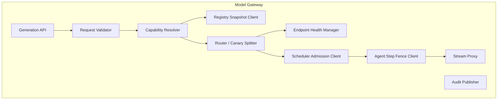

# 011 - Model Gateway

| | |
|---|---|
| **Document status** | Production-reconciled architecture v4; implementation evidence pending |
| **Plane** | Data Plane (request-time routing) |
| **Conforms to** | Doc 001 capability/no-fallback and `AGENT-EXECUTION-ENVELOPE`; Doc 004 capability request; Doc 009 cache boundary; Doc 010 eligibility; Docs 013/014 scheduler and model-step fences |
| **Dependency note** | Document numbering is not runtime authority order. Gateway consumes Doc 014 step fences; Doc 014 consumes Gateway's dispatch-attempt identity plus Doc 012-signed runtime outcome evidence. Their idempotent APIs fail closed independently and do not form one distributed transaction. |
| **Depends on** | 004 Orchestrator, 010 Registry, 012 Inference, 013 Scheduler, 014 Agent step fences, 019 Cost, 021 Audit, 024 Contracts and 025 Workload Identity |

---

## 1. Executive Summary

The Model Gateway is the request-time route-execution layer for internal model inference. It receives capability-based generation requests from the Orchestrator, resolves them against signed eligible/rollout Registry snapshots and live Scheduler capacity, applies the approved canary policy, forwards streaming generation to internal Inference Pool endpoints, and returns typed errors.

It never calls external model providers and never silently falls back to cloud. It does not own model metadata approval (Doc 010), token execution (Doc 012), or global GPU admission policy (Doc 013).

**System-design framework coverage: 10/10.**

## 2. System-Wide Consistency Check

The audit required two baseline changes: request-time routing is Data Plane, and last-known-good Registry data cannot override emergency revocation or live forever. Docs 001/010 now define bounded signed snapshots and a monotonic emergency-deny epoch. External/provider fallback remains rejected.

## 3. Architecture Research / Industry Evidence

| Decision | External evidence | Why it works there | Applicability to us | Decision |
|---|---|---|---|---|
| Capability/custom routing and prefix-aware routing | Ray Serve LLM supports custom routing, prefix/session-aware routing, autoscaling, and multi-node LLM serving: https://docs.ray.io/en/latest/serve/llm/index.html | Routing can improve cache locality and utilization | Our Gateway can use internal KV locality hints without owning KV cache | **Adapt** internal capacity/KV-aware routing |
| Traffic splitting/canary rollout | KServe LLMInferenceService supports weighted canary rollout and warns that zero-weight dark backends may cause transient connection issues: https://kserve.github.io/website/docs/next/model-serving/generative-inference/llmisvc/canary-rollout | Real traffic validates full serving stack; rollback remains possible | We need safe internal model rollout | **Adopt** weighted internal canary with warm minimum traffic or explicit warmup |
| Inference graphs/splitters | KServe InferenceGraph supports switch/splitter/ensemble routing: https://kserve.github.io/website/docs/concepts/resources/inferencegraph | Routing logic belongs in a graph/router, not each caller | Model Gateway centralizes model routing policy | **Adapt** simple splitter/switch routing; avoid complex model chains in Phase 1 |
| Global rate limiting for many-to-few fan-in | Envoy global rate limiting docs describe cases where many downstream hosts can overwhelm fewer upstream hosts: https://www.envoyproxy.io/docs/envoy/latest/intro/arch_overview/other_features/global_rate_limiting.html | Protects scarce upstream capacity | Orchestrator instances can overwhelm limited GPU endpoints | **Adopt** global internal admission/rate checks with Scheduler |
| External fallback in gateways | Public LLM gateway docs advertise automatic provider fallback: https://docs.llmgateway.io/features/routing | Works for SaaS cost/availability optimization | Violates zero-egress sovereignty | **Reject** external fallback |

## 4. Scope

**In scope:** capability resolution, internal model endpoint selection, health/circuit breaking, execution of signed canary/rollout policy, consumption of Doc 014 model-step fences and unchanged relay of Doc 012 runtime usage receipts, streaming proxy to Inference Pool, model-unavailable error typing, Gateway-to-Scheduler admission coordination, routing audit.

**Out of scope:** model approval, eligibility and rollout-policy mutation (Doc 010), agent-run envelope/counter policy (Doc 014), token execution (Doc 012), GPU scheduling policy (Doc 013), prompt composition (Doc 004), response caching (Doc 009).

## 5. Component Architecture



## 6. Routing Flow

```mermaid
sequenceDiagram
    participant O as Orchestrator
    participant G as Model Gateway
    participant R as Model Registry
    participant S as GPU Scheduler
    participant A as Agent / Tool Execution
    participant I as Inference Pool

    O->>G: generate(request_id, capabilities, context, budget ref, agent step fence, deadline)
    G->>G: validate request and deadline
    G->>R: verify signed eligibility/rollout snapshot + current emergency-deny epoch
    G->>G: resolve eligible internal deployment under approved policy revision
    G->>S: reserve(request digest, input/output estimates, budget ref, deadline)
    alt admitted
        S-->>G: reservation_id + endpoint + grant + lease_expiry + fencing_token
        G->>R: recheck deny epoch before dispatch
        G->>A: StartAgentStep(step fence, attempt, endpoint generation, scheduler digest, request digest)
        A-->>G: one-use start receipt
        G->>I: start(reservation_id, scheduler fence, step receipt, request_digest); stream
        loop Generated chunks
            I-->>G: token chunk
            G-->>O: token chunk
        end
        G->>A: FinalizeAgentStep(Doc 012-signed outcome and usage receipt)
        A-->>G: step-finalization revision
        G-->>O: terminal generation outcome
    else unavailable
        S-->>G: no capacity
        G-->>O: model_unavailable
    end
```

## 7. Error Semantics

| Error | Meaning |
|---|---|
| `capability_unresolvable` | No approved/routable model satisfies requirements |
| `model_unavailable` | Eligible model exists but no internal capacity/healthy endpoint |
| `generation_error` | Inference began or failed inside Inference Pool |
| `deadline_exceeded` | Request deadline cannot be met |
| `gateway_overloaded` | Gateway cannot accept more routing work |
| `agent_limit_reached` | Doc 014 run/step envelope is exhausted, expired, frozen, invalid or replayed |
| `agent_usage_unreconciled` | Runtime reached a terminal state but Doc 014 has not accepted its exact signed usage receipt; output cannot finalize/release yet |

External fallback is never an error recovery path.

## 8. Retry and Streaming Policy

- Absence of a first token is not proof that dispatch did not start. Gateway queries the Scheduler/runtime attempt state before considering another endpoint.
- A pre-token retry is allowed only after the old attempt is proven `NOT_STARTED`, or proven terminal/cancelled with its fence revoked; ambiguous state returns `generation_outcome_unknown`. Any retry obtains a new/reassigned reservation and budget scope.
- After first token, no retry/replay/resume.
- Streaming events are forwarded as received.
- Generated chunks may flow internally to Doc 004's protected buffer, but Gateway withholds the terminal generation outcome until Doc 014 accepts the exact Doc 012-signed usage receipt. If that owner path is unavailable, it returns `agent_usage_unreconciled`; reconciliation never regenerates or credits from Gateway counters.
- Client cancellation from Orchestrator propagates to Inference Pool.

## 9. Canary / Rollout

- Routing groups are internal model deployment groups.
- Digest-pinned members, weights and assignment-key policy come from one signed immutable Registry rollout revision; Gateway cannot mutate them.
- Assignment is deterministic for the configured stable key and recorded with the rollout revision, but Scheduler capacity/health may select only another member that the same policy explicitly permits.
- New canary endpoints must pass readiness and warmup.
- Avoid pure dark `weight=0` promotion unless warmup traffic/probes exercise the backend.
- Rollback is weight reduction or endpoint removal; Registry routability may also be revoked.

## 10. Data Model

```sql
CREATE TABLE model_route_group_projection (
    group_id      TEXT PRIMARY KEY,
    capability_hash TEXT NOT NULL,
    active        BOOLEAN NOT NULL
);

CREATE TABLE model_route_member_projection (
    group_id      TEXT NOT NULL,
    model_id      TEXT NOT NULL,
    version       TEXT NOT NULL,
    weight        INT NOT NULL,
    status        TEXT NOT NULL,
    PRIMARY KEY (group_id, model_id, version)
);
```

These tables are rebuildable read-only projections of signed Doc 010 snapshots, not Gateway-owned promotion or rollout authority. A missing, rolled-back, expired or unverifiable projection blocks new dispatch.

## 11. Capacity Planning

```text
gateway_routing_qps = generation_request_qps
registry_snapshot_load = gateway_instances * snapshot_refresh_rate
scheduler_admission_qps = generation_request_qps
stream_connections = concurrent_generating_requests
```

Gateway scales on active streams and routing QPS, not CPU alone.

## 12. Failure Mode Matrix

| Failure | Behavior |
|---|---|
| Registry unavailable | Use a signature-verified eligibility/rollout snapshot only within `max_age` and only while emergency-deny freshness is provable; otherwise reject new dispatch |
| Scheduler unavailable | Fail fast `model_unavailable`; do not guess GPU capacity |
| Agent run/step owner unavailable, stale, exhausted or replayed | Release/expire the Scheduler lease and fail closed before Inference start; no local limit cache or replacement run |
| Runtime terminal receipt cannot be admitted/finalized by Doc 014 | End internal stream with `agent_usage_unreconciled`; preserve signed receipt for idempotent owner reconciliation and do not claim a completed generation |
| Inference endpoint unhealthy before token | Reconcile the old attempt; reassign only after `NOT_STARTED` or terminal/cancelled plus fence revocation is proven, otherwise return outcome unknown |
| Inference fails after token | Terminate stream; no replay |
| Gateway overloaded | Return `gateway_overloaded` |
| External provider requested | Reject; no such route |
| Endpoint node/artifact attestation missing, stale or mismatched | Reject dispatch and ask Scheduler to quarantine capacity; endpoint health alone cannot establish trust |

## 13. Security / Observability

- mTLS for Orchestrator, Registry, Scheduler, Inference Pool.
- Gateway reachable only from Orchestrator and approved internal APIs.
- Audit evidence includes request ID, selected artifact digest/model version, registry/deny epochs, capability match, route group, budget decision, reservation/fence reference and terminal outcome, never prompt/output content.
- Metrics: routing latency, active streams, route decisions, canary weights, endpoint health, pre-token retries, post-token failures.
- Dispatch verifies Doc 010 model eligibility, Doc 024 software provenance, Doc 012 endpoint-generation attestation and the Doc 013 lease/fence. No one signal substitutes for the others.
- Every dispatch also requires Doc 014 to atomically consume an exact, unexpired `AGENT-EXECUTION-ENVELOPE` step fence. Only Doc 012-signed/outbox-backed runtime evidence can finalize actual model usage; Gateway may relay it unchanged, and neither Gateway nor Orchestrator can credit a run.

## 14. Cross-Document Contracts

| Direction | Contract | Status |
|---|---|---|
| **Fulfilled** - Doc 004 -> Doc 011 | Three typed terminal errors and capability request handling | Defined here |
| **Fulfilled** - Doc 010 -> Doc 011 | Consumes signed eligible-model and rollout-policy snapshots; Gateway cannot author either | Defined here |
| **Fulfilled** - Doc 011 -> Doc 012 | Inference Pool exposes fenced stream start, health, cancellation and artifact/endpoint metadata | Defined in Doc 012 |
| **Fulfilled** - Doc 011 <-> Doc 013 | Scheduler provides reservation, endpoint grant, lease/fence and attempt reconciliation | Defined here and in Doc 013 |
| **Fulfilled** - Doc 011 <-> Doc 019 | Gateway validates/enforces budget references; Cost Controller owns reservations and consumes finalized usage | Defined here and in Doc 019 |
| **Fulfilled** - Doc 011 <-> Doc 014 | Every model dispatch consumes one run-envelope step fence and relays Doc 012-signed terminal usage; Gateway cannot set/reset aggregate limits or author usage | Defined here and in Docs 012/014 |

## 15. Gateway ADRs

### ADR-MGW-001: Internal-only routing
**Status:** Accepted

### ADR-MGW-002: Capability resolution before endpoint selection
**Status:** Accepted

### ADR-MGW-003: No retry after first token
**Status:** Accepted

No-token-yet is also not a retry guarantee: a new attempt requires authoritative proof that the old reservation was not started or is terminal/cancelled and fenced off.

### ADR-MGW-004: Weighted internal canary rollout
**Status:** Accepted
**Decision:** Gateway executes the exact signed rollout revision owned by Registry, records its assignment, and cannot change members/weights or make an ineligible artifact routable.

### ADR-MGW-005: Scheduler admission before inference dispatch
**Status:** Accepted

### ADR-MGW-006: Eligibility snapshots are bounded by emergency revocation
**Status:** Accepted
**Decision:** Gateway accepts only signed monotonic Registry snapshots inside explicit max age. Unknown/stale emergency-deny epoch blocks new dispatch; aliases and last-known-good data cannot override revocation.

### ADR-MGW-007: Dispatch requires an unexpired scheduler fence
**Status:** Accepted
**Decision:** Every runtime start carries reservation ID, request digest and fencing token. Retry/reassignment is mediated by Scheduler; Gateway never invents capacity from endpoint health.

### ADR-MGW-008: Endpoint health is not endpoint trust
**Status:** Accepted
**Decision:** A healthy socket/runtime receives no request unless its node/runtime/model digest and attestation match the current approved endpoint generation. Stale or uncertain trust fails dispatch closed.

### ADR-MGW-009: Every model start consumes one owner-issued agent step
**Status:** Accepted
**Decision:** Model Gateway requires Doc 014's exact one-use step start receipt before contacting Inference Pool and relays only Doc 012-signed terminal usage back to Doc 014. A simple chat is a one-step run; an omitted envelope is never interpreted as non-agent traffic.

## 16. Implementation Readiness

| Check | Result |
|---|---|
| No external fallback | **Pass** |
| Registry/Gateway separation | **Pass** |
| Inference execution not moved into Gateway | **Pass** |
| Streaming semantics preserved | **Pass** |
| GPU capacity delegated to Scheduler | **Pass** |

**Implementation verdict: SECURITY-HARDENED; GO REQUIRES AGENT-STEP REPLAY/EXHAUSTION/OWNER-LOSS, ENDPOINT-ATTESTATION/ARTIFACT-SUBSTITUTION, REVOCATION-RACE, SNAPSHOT-EXPIRY, RESERVATION-FENCE, RETRY, CANARY AND OVERLOAD EVIDENCE.**


---

## Review Reconciliation - Admission Before Dispatch

Review item addressed: H4.

Model Gateway resolves capability eligibility first, validates the Doc 019 budget decision reference, then requests Scheduler reservation using inference-native estimates: input tokens, reserved output budget, request class, latency class, security-salted prefix locality hint and model/runtime profile. It dispatches only after receiving a `reservation_id`, endpoint grant, lease expiry and fencing token.

If Scheduler rejects due to full-ISL KV fit, token throughput, active-sequence concurrency, queue delay, or stale telemetry, Gateway returns a typed capacity error rather than blind-dispatching to a nominally healthy GPU endpoint.

## Review Reconciliation v2 - Bounded Eligibility and Fenced Dispatch

- Request-time routing is Data Plane. Registry promotion and artifact governance remain Control Plane.
- Eligibility snapshots include artifact digests, `registry_epoch`, `emergency_deny_epoch`, issue time, max age and signature. New dispatch fails closed on rollback, expiry or deny uncertainty.
- Endpoint health is necessary but not capacity. Scheduler lease/fence is the only admission authority, and the Inference Pool rejects stale/consumed fences.
- Cost Controller authors budget decisions; Model Gateway and Scheduler only enforce the reservation reference obtained by Orchestrator.
- Any pre-token retry first proves the old attempt did not start or is terminal with a revoked fence, then obtains a new or explicitly reassigned reservation. A missing token alone never permits retry. Post-token retry/replay remains forbidden.

KServe's weighted canary mechanics support explicit split/rollback, while Envoy's many-to-few upstream protection supports centralized admission ahead of scarce endpoints (https://kserve.github.io/website/docs/next/model-serving/generative-inference/llmisvc/canary-rollout and https://www.envoyproxy.io/docs/envoy/latest/intro/arch_overview/other_features/global_rate_limiting.html). These techniques are adapted internally; routing remains capability-driven and provider-neutral.

---

## Review Reconciliation v3 - Generation Context Fence Enforcement

For any dispatch containing Retrieval-derived protected context, Model Gateway requires a Doc 005 `generation_context_fence` in addition to the Registry eligibility, Cost, and Scheduler reservation fences. It verifies attested caller, request ID, exact packaged-context digest, `use_boundary=generation_start`, expiry, signature, and one-use status before it contacts Inference Pool; it records consumption in the same fenced dispatch-attempt transition. Missing, stale, mismatched, or already consumed context fences reject before GPU/KV allocation. Model Gateway does not authorize the context or cache the decision; PDP remains the live authority and Doc 004 remains the coordinator.

## 17. Production Readiness v4

Model Gateway consumes `REQUEST-DEADLINE-CANCELLATION`, `SERVING-BULKHEAD`, `DEPLOYMENT-CAPACITY-PROFILE`, `FAILURE-DOMAIN-CAPACITY`, `SLO-ERROR-BUDGET`, `ROLLING-UPGRADE-COMPATIBILITY` and `PRODUCTION-READINESS-EVIDENCE`. It preserves the request bulkhead and uses independent route-resolution, reservation and stream-control concurrency per bulkhead/model capability. Ordinary starts cannot consume the reserved cancellation, revocation, reconciliation or health capacity. A dispatch is rejected when the remaining absolute deadline cannot cover Scheduler wait, runtime work and Orchestrator's protected finalization reserve.

The gate sustains 1,300 concurrent generating requests and the profile-derived start/burst rate across the real capability mix while losing the largest Gateway/GPU domain, revoking a model, saturating one capability and cancelling 25% of streams. It proves no unadmitted dispatch, no ambiguous retry duplication, fair bounded spillover, route/lease latency within the final-answer budget and N/N-1 request/reservation/runtime-receipt compatibility. Canary comparison and rollback use eligible exact digests; revocation and durable attempt evidence never roll backward.

## Security Contract Conformance v4

Doc 011 consumes `AGENT-EXECUTION-ENVELOPE`, `SECURE-SOFTWARE-DELIVERY`, `PLATFORM-HARDENING`, `SECURITY-INCIDENT` and `CRYPTOGRAPHIC-PROFILE`. It owns dispatch protocol and eligibility enforcement, but cannot mint authorization, set/reset agent limits, change model eligibility, allocate quota, attest a node or weaken an incident restriction.

Canonical dependencies additionally enforced here are `SCHEDULER-LEASE`, `MODEL-REVOCATION`, `ARTIFACT-PROVENANCE`, `MODEL-CAPABILITY-PROFILE`, `INFERENCE-ADMISSION-UNITS` and `STREAM-FINALIZATION`.

## Development Exception: External Synthetic-Data Provider

This document's production model-gateway rules remain unchanged. A development
adapter may call a named external provider only for a corpus declared
synthetic, with a server-held key and no browser/provider direct connection.
The adapter is disabled by default, is not production eligible, has no fallback
semantics, and must use bounded requests, deadlines, generic error responses
and redacted telemetry. A future privately hosted model service is treated as
an internal provider only after its network, identity, data-residency,
retention, audit, capacity and failure-domain controls are reviewed.
